<!-- This is the README for CS254 (Machine Learning) Final Project -->

# Predicting the Pathogenicity of Mutations in the Helix Mitochondrial Genome Mutation Database (HelixMTdb)

*The goal of this assignment was to apply the methods of CS254 Machine Learning to predict some outcome based on a large dataset. I chose to predict the pathogenicity of mutations present in the Helix mitochondrial DNA mutation database (HelixMTdb).  I sought to model whether a variant detected in the participating population was pathogenic based on allele frequencies, allele plasmicity, the nature of the base pair change, and the type of sequence affected. I found that models lacking more information about the conservation of an affected nucleotide, the nature of the affected gene and the effect of the change on protein sequence, were only able to base their predictions on allele frequency and plasmicity. Furthermore, my results were considerably limited by the lack of known pathogenic variants in the HelixMTdb.*

## Introduction

Mitochondria are essential mediators of fat and carbohydrate metabolism in all eukaryotic organisms.  They are likely descended from a free-living bacterial ancestor that took up residence within a eukaryotic cell more than one billion years ago.  Reflecting this evolutionary history, mitochondria are enveloped in a double membrane, produce their own ribosomal RNA, and contain their own circular, bacterial-like genome (mtDNA) that encodes 13 proteins involved in the electron transport chain, 22 tRNAs, and 2 ribosomal RNAs (Figure 1).  Mutations in mtDNA are relatively common due mainly to their oxidizing environment and the 10-fold higher mutation rate of mitochondrial DNA polymerase compared to nuclear DNA polymerases.  Most variation in mtDNA sequences is confined to the non-coding control region, the D-loop, which mediates mtDNA replication and has been used to infer maternal ancestry in humans, as all mtDNA is maternally inherited.  The number of mitochondria per cell body varies widely among tissues, with the highest numbers in oocytes, neurons, liver and muscle cells.  The number of mtDNA copies per mitochindrion varies per cell and mutations may arise independently within any one of them. Consequently, most cells contain an ensemble of mitochondria bearing distinct genomes, a condition known as heteroplasmy.  In the case of homoplasmy, the composition of mitochondria within a cell is uniform.  

### Figure 1. Human mtDNA

<figure>
  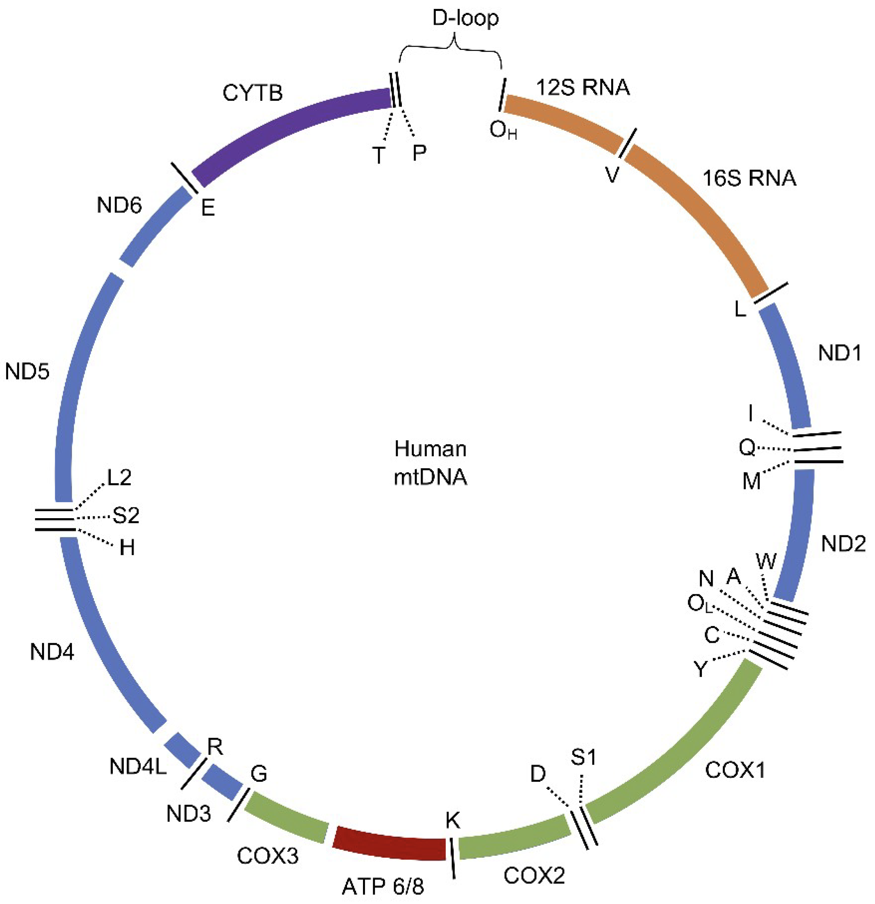
  <figcaption>Boguszewska, K. et al.</figcaption>
</figure>

The incidence of mitochondrial disorders (Figure 2) is roughly 1 in 5000 and at least 1 in 200 people are carriers of potentially pathogenic mutations.  The penetrance of mitochondrial disorders is highly variable and depends on whether a mutation is homoplasmic or heteroplasmic.  In the latter case, a disease phenotype is believed to arise only when the fraction of mutant mitochondria within a cell exceeds some threshold, the value of which varies per allele.  

### Figure 2. Known disease causing mtDNA mutations

<figure>
  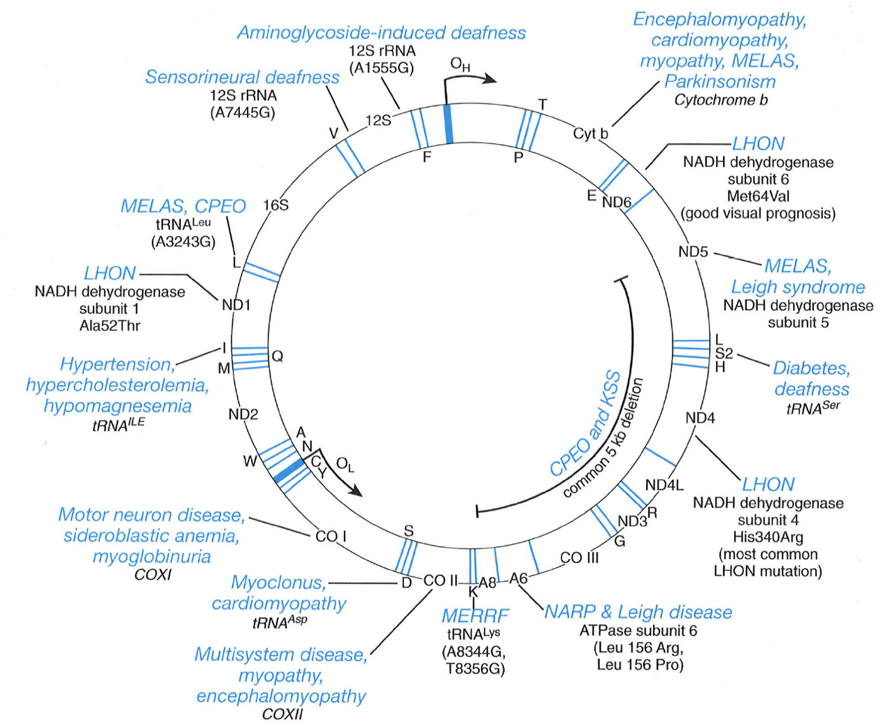
  <figcaption>Nussbaum, R.L., McInnes, R.R., and Willard, H.F., 2007 <em>Thompson and Thompson Genetics in Medicine 7th ed.</em> Philadelphia: Saunders</figcaption>
</figure>

## Problem Definition and Algorithm

We have examined the Helix mitochondrial DNA database (HelixMTdb) and known pathogenic mtDNA mutations curated by the MitoMap consortium to develop a predictive model of the pathogenicity of mtDNA mutations. Given the estimate of 1:200 for the frequency of carriers, we would expected to find approximately 1000 individuals harboring genuine pathogenic mutations among those that contributed to the HelixMTdb dataset.

The genetic code consists of the mapping of nucleotide triplets called codons encoded by the nuclear genome to particular amino acids in proteins.  
Nuclear DNA is transcribed to messenger RNA, which serves as the template for protein synthesis. The nucleotide code is translated into the amino acid sequences of proteins by transfer RNAs (tRNAs) with the assistance of ribosomal RNA (rRNA) within the ribosome. Mitochondria utilize a variant genetic code (shown below) to express their genes as proteins.  

### The human mitochondrial genetic code

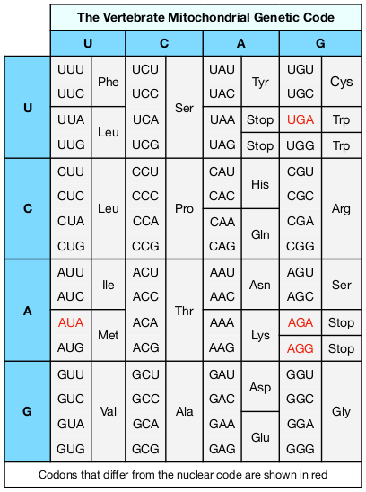

Like the nuclear code, the mitochondrial code is degenerate, offering up to four codon options per amino acid.  Thus, mutations affecting the third base position of codons are usually tolerated, as the amino acid encoded by the variant is often the same as that of the wild-type codon. When the first or second codon positions are affected by mutation, it is possible that the new amino acid inserted into the growing protein is usually chemically similar to the wild-type one.  However, deleterious effects often result. Accordingly, if I were confronted with an alignment of mtDNA sequences and had to decide whether a particular mutation was potentially harmful I’d consider:

- Is the base conserved/invariant?  If so, how widely (in which species?) 
- Is the base in coding or in non-coding sequence? If coding, which position in the codon is affected?
- Which protein is affected and what is its role? 
- What is the nature of the mutation? (point mutation? insertion? deletion? - for latter two, involving how many bases; frameshift?)
- Where in the protein is the affected amino acid? Is an internal or surface residue affected?  Is an enzyme’s active site affected? Is a protein-protein interaction domain affected?

Given the nature of the mitochondrial genetic code, we sought to determine which bases in human mtDNA are invariant, and thus are absent from the Helix data of detected variants, the propensity of variants to arise in the first, second, or third position of codons, the difference in the frequencies of variants detected within coding vs. non-coding sequences, and the distribution of the kinds of mutations detected (transition, transversion, or insertion-deletions). Furthermore,  we examined the distribution of homoplasmic vs. heteroplasmic variants, as the initial analysis of the HelixMTdb (Bolze et al.) suggests that harmful mutations are more likely to be heteroplasmic.  Presumably, a deleterious mutation would not be permitted to reach homoplasmy, because a pure population of mutant mitochondria would compromise the health of the cell and such debilitated cells would drop out of the population. Thus, we expected that the most harmful mutations detected would be heteroplasmic, if detected at all.  Our exploratory data analysis is discussed further below.

Our modeling efforts were concentrated on the features elaborated by our EDA to classify whether a variant is likely to be pathogenic or not including: the codon position affected, the count or frequency of homoplasmic and heteroplasmic variants, and the type of mutation present.  We had the most success with a random forest, and less so with logistic regression and a support vector machine with a sigmoid kernel.

## Related Work

The Helix mtDB was initially presented and analyzed by Bolze, et. al.  Allele frequencies were determined for each variant detected and the most constrained regions of the mitochondrial genome were identified as those mostly corresponding to rRNA genes and some tRNAs. The only analysis of disease causing mutations by these authors concerned mutations likely to cause a single disease, Leber’s Hereditary Optic Neuropathy, for which the MitoMap database is enriched in known pathogenic mutations.  No predictive modeling was performed.  We sought to produce a general model to predict the pathogenicity of mitochondrial DNA variants based on patterns of mtDNA variation exhibited by the population of nearly 200,000 individuals examined by Helix.

## Data Description

The HelixMTDdb presents a total of over 5 million nucleotide polymorphisms in the mtDNA of more than 195,000 individuals who voluntarily donated saliva samples to Helix for general genomics research. The HelixMTDdb allows us to infer the proportions of mutations of various types in mtDNA sequences in a somewhat ethnically diverse population that was not recruited specifically because they had a mitochondrial disorder or a family member with such a disorder. The HelixMTDdb is available for download from <https://www.Helix.com/pages/mitochondrial-variant-database>.  The database consists of alleles that differ from the Cambridge reference human mtDNA sequence (GenBank: J01415.2).  The variables that we focussed on for our analyses included:

- locus: the map location in mtDNA of the variant detected.
- alleles: the base pair changes detected
- feature: the type of sequence (non-coding, protein, rRNA, or tRNA)
- gene: the gene in which the variant was detected
- counts_hom: the number of homoplasmic variants detected per locus  
- counts_het: the number of heteroplasmic variants detected per locus
- AF_hom: the homoplasmic allele frequency
- AF_het: the heteroplasmic allele frequency
- mutation: the type of base change (transition, transversion, or in-del)
- annotation: non-coding, tRNA, rRNA, or the codon position affected for protein coding genes

The Helix data are unlabeled, regarding the potential pathogenicity of alleles.  Bolze et al. compared known pathogenic mutations recorded in the MitoMap database <https://www.mitomap.org/MITOMAP> with the variants detected by Helix. We also determined the intersection of the MitoMap collection of variants reported to be pathogenic with the HelixMTDdb, as well as with the nucleotides classified as invariant based on their absence from the HelixMTDdb.  We added labels to indicate whether a variant was reported to be pathogenic if variants at the same base were present in the MitoMap collection.

## Exploratory Data Analysis

The HelixMTDdb lists variants found at 10,253 nucleotides out of the entire 16,569 base pair (bp) mitochondrial genome (Table 1).  This leaves 6316 nucleotides, for which no variants were detected.  There are no significant differences in the base composition of variable and invariant mtDNA sequences (data not shown).  However, there are obvious differences between variable and invariant sequences considering which positions within codons are most often represented.  These data are shown in Table 2 and in Figure 3. Given that the third base of many codons is permitted to vary, most variation among the protein coding nucleotides represented in the HelixMTDdb occurs in the third position of codons.

### **Table 1.** Summary of the HelixMTdb

|        |            |
---------|------------|
 **total length of human mtDNA** | 16,569 |
 **bases present in the HelixMTdb** | 10,253*  |
 **total invariant bases** | 6316 | 
 **total coding bases** | 9607˚ (93.7% of variant bases) |
 **total non-coding bases** | 646
 **total number of non-coding alleles** | 1,427,782 (28.3% of all alleles) |
| *multiple alleles exist for several bases | | | |
| ˚Due to the presence of overlapping reading frames, this number is not exact but is based on the total bases annotated as “coding”| | | |

### **Table 2.** Distribution of codon positions

| Present in HelixMTdb |      |       |       |        |
----------|----------|----------|----------|----------|
|         |   **first**  |  **second**  |   **third**  | **anticodon**|
|**count**|  2689 |  1660  |  5258 |     6    |
**proportion**|  0.2799 |  0.1728  |  0.5473  |       |
| | | | | |
| **Absent from HelixMTdb (invariant)** |      |       |       |        |
|         |   **first**  |  **second**  |   **third**  | **anticodon**|
|**count**|  1650 |  2367  |  67 |     56    |
**proportion**|  0.4040 |  0.5796  |  0.0164  |       |

### Figure 3. Variant and invariant bases affect different codon positions

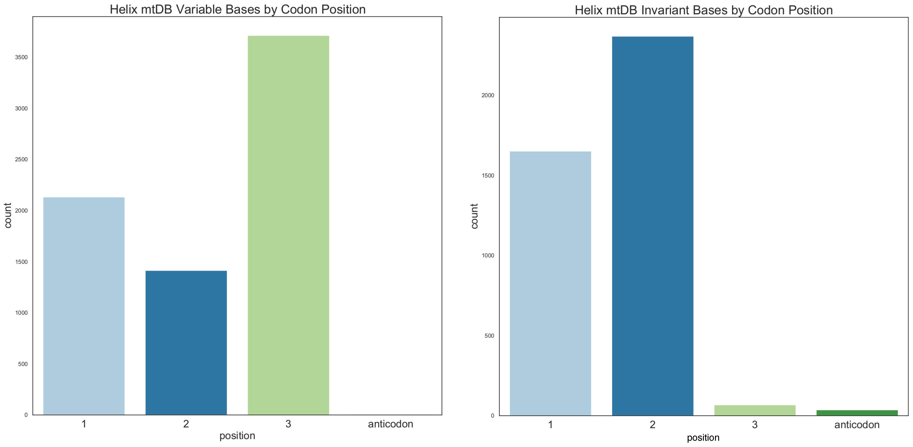

In contrast to the variants detected among Helix subjects, most invariant nucleotides are found in the first and second positions of codons. The MitoMap alleles of reported pathogenic variants that are also present in the Helix mtDB (Figure 4) are more likely to involve the first and second codon positions, although variants affecting the first codon position outnumber those affecting the second. The excess of bases in the second position of codons among invariant nucleotides suggests that such variants are less compatible with life than those affecting the first position.

### Figure 4. MitoMap candidate pathogenic alleles predominantly affect first and second codon positions

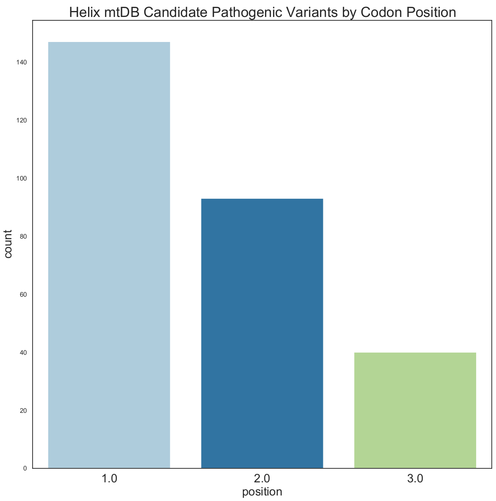

Also shown in Table 2 are 56 invariant nucleotides present within the anticodon loops of tRNAs. Given the vital role these nucleotides play in translating the genetic code during protein synthesis, it was no surprise to find that 6 times as many anticodon positions are invariant as those that may vary.  

Due to the evolutionary constraints on expressed sequences, we expected to find more variability in the types of mutations allowed for non-coding sequences than for coding sequences. Insertion-deletion mutations (indels) are particularly harmful to proteins, as they often disrupt the reading frame of all codons downstream of where they occur and are almost always harmful. Among point mutations, transitions involve the substitution of one nucleotide by a chemically similar nucleotide, but transversions involve substitution by a chemically distinct nucleotide. As shown in Figure 5 below, there are very few indels among protein-coding genes, in contrast to non-coding genes. Furthermore, higher proportions of indels and transversions are found among the protein coding variants classified as pathogenic by MitoMap (Figure 6), suggesting such mutations are indeed more harmful.

### Figure 5. Protein coding variants are mostly transitions, indels abound among non-coding sequences

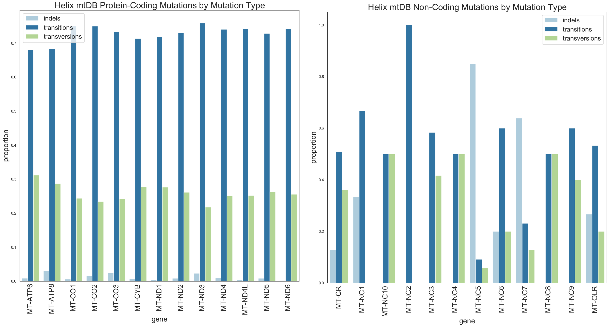

### Figure 6. Indels are more likely among candidate pathogenic protein coding variants 

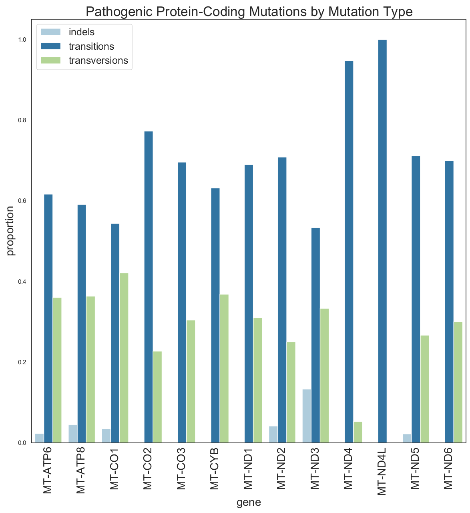

The least certain aspect of the HelixMTtdb is the classification of allele plasmicity.  The plasmicity of variants in the HelixMTtdb was determined by examining the variety of sequence reads obtained from cheek cells present in saliva samples. If invariant sequences were recovered for a given allele, it was classified as homoplasmic.  In contrast, if a mixture of sequences was reliably obtained for an allele from a given sample, it was classified as heteroplasmic.  However, as most mitochondrial diseases affect muscle cells and and the nervous system, the relevance of the Helix plasmicity classifications towards predicting the pathogenicity of variants is unclear, especially since mitochondria are not evenly distributed to all cells during embryonic development. Also, mutations that might be harmful in one cell type may not be harmful in another cell type. Thus, the plasmicity of mutations tolerated in cheek cells may not be relevant to the prediction of mitochondrial disease risk. It would have been ideal to have obtained mtDNA from muscle biopsies, but not very practical for sampling a very large number of individuals, as was done by Helix.  We must work with the data we have and not the data we wish we had. In general, however, the allele frequencies of homoplasmic variants appear to be much higher ( ≥ 2 orders of magnitude) than for heteroplasmic alleles at the same base (Figure 7).

### Figure 7. Homoplasmic variants far outnumber heteroplasmic variants per gene

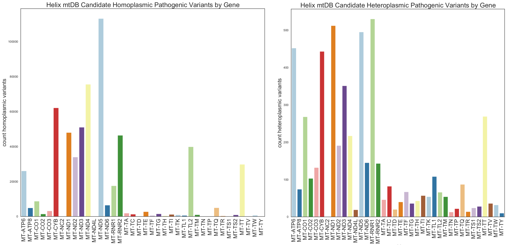

We examined the distributions of variants shared between the Helix mtDB and the MitoMap collection of pathogenic variants by plotting the logarithm of homoplasmic alleles vs. the logarithm of heteroplasmic alleles detected for each variant (Figure 8, pathogenic variants are colored green, heteroplasmic variants left, homoplasmic, right).

### Figure 8. No linear separation between pathogenic alleles shared between MitoMap and the HelixMTdb and uncharacterized variants

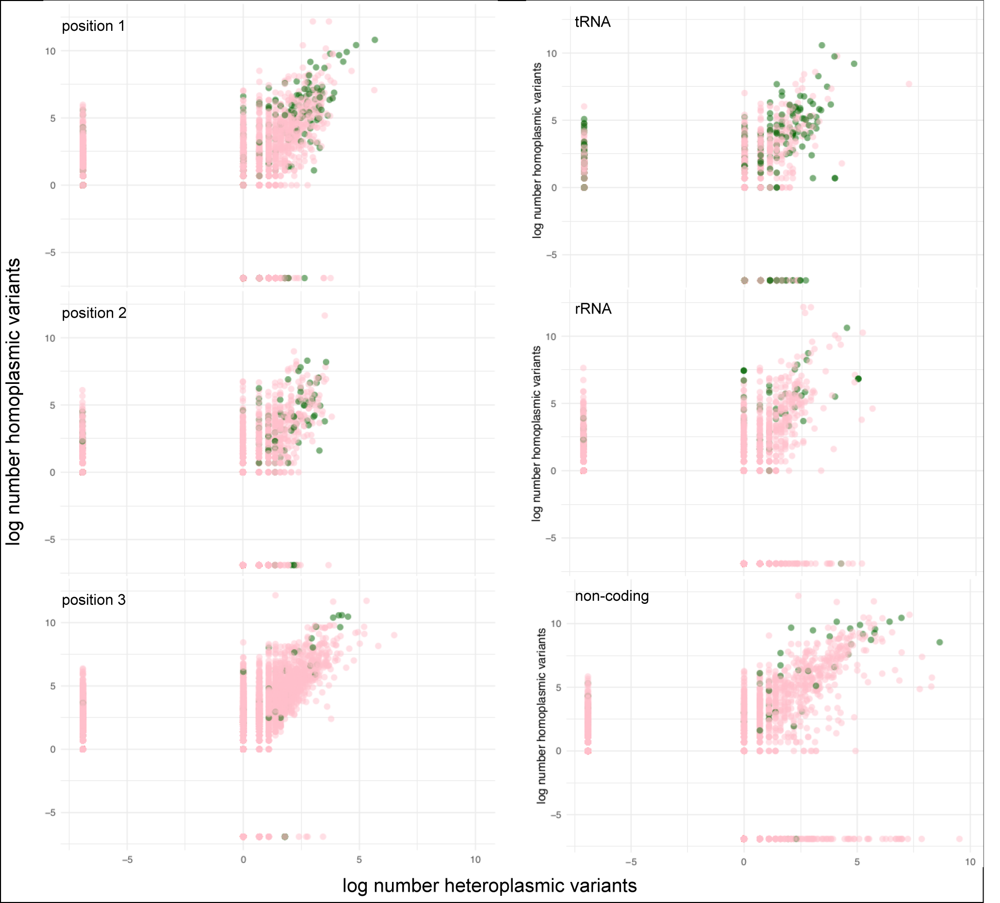

Differences between allele distributions are greater than they appear, given the logarithmic scales of the plots. It is clear from the point spreads on each plot that alleles affecting the first two codon positions are not as numerous as those affecting the third position.  This mirrors the information in Table 2 and related figures shown above.  More pathogenic variants appear among first and second codon positons and within tRNAs.  Several candidate pathogenic variants are also found among third codon positions and within non-coding sequences.  Given their wider point spread, the frequencies attained by non-coding alleles are obviously greater than those affecting the consequential codon positions 1 and 2, and rRNA and tRNA genes.  The maximum frequencies of pathogenic alleles for a given sequence type appear to be independent of plasmicity.  Most importantly, the figures above show there is no *linear* separation between pathogenic and benign mtDNA variants present within the HelixMTdb.

## Description and Evaluation of Models: Towards a Machine Learning Algorithm for mtDNA Variant Pathogenicity Prediction

Our exploratory data analysis, in light of what we know about the genetic code and the central dogma of molecular biology, leads us to the following algorithm for deciding whether a particular mitochondrial variant is likely to be deleterious.

### Figure 9. A "human learning" algorithm for mtDNA variant pathogenicity prediction

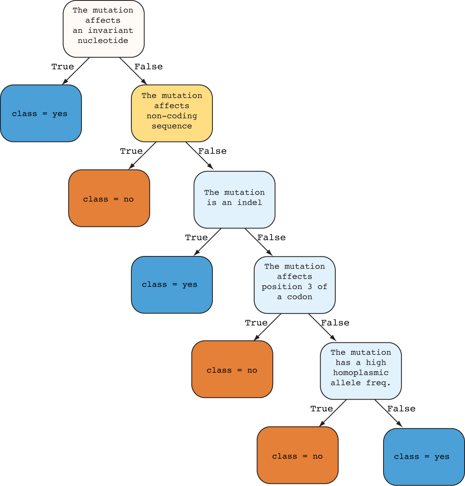

This “human learning” algorithm may not scale easily to very large datasets and may not perform as well as a less biased more quantitative method.  Our entirely qualitative EDA-based algorithm led us to consider a machine learning approach to the prediction of allele pathogenicity beginning with decision trees and random forests, as they are capable of distinguishing non-linearly separable classes.  We also assessed logistic regression and support vector machines with non-linear features for their ability to differentiate our labeled data as pathogenic ‘yes’ vs. pathogenic ‘no.’ Given that we can only be fairly certain about what is pathogenic from the MitoMap data, we began by labeling mutations more numerous than known pathogenic mutations as not pathogenic (still injecting a bit of human judgement into the algorithm).  Eighty-two such mutations were found among Helix variants.  We sampled an equivalent number from the 846 pathogenic alleles annotated by MitoMap to eliminate the issue of class imbalance when training our algorithms. We also considered training a model to distinguish between pathogenic variants and ‘unknown’ variants, making no assumptions about the frequencies of potentially pathogenic alleles. For this approach we also sampled 846 ‘unknown’ variants to form balanced training and testing data sets.  

A decision tree constrained by the requirement of a minimum of 5 samples per leaf to control overfitting yielded a test error of 0.82.  This tree, shown in Figure 10, does probably overfit the data, despite our added constraint.

### Figure 10. Initial decision tree

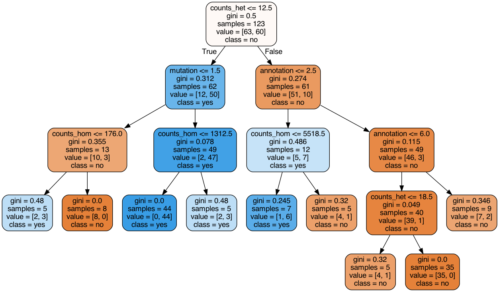

| | "annotation" |         |   "mutation"  |
---------|------------|----------|-----------|
|**1**| codon position 1 | **1** |indel   |
**2**| codon position 2 | **2** | transition |
**3**| codon position 3 | **3** | transversion |
**4**| anticodon loop |  |  |
**5**| non-coding | | |
**6**| replication origin | | |
**7**| rRNA | | |
**8**| tRNA | | |

We sampled an equal number of pathogenic variants to match the 82 non-pathogenic variants and regenerated training and test data sets over 1000 iterations and achieved an average test accuracy of 90% with a standard deviation of 0.06 with a decision tree limited to a minimum of 5 samples per leaf.  We then employed cost-complexity pruning using a cost-complexity parameter of 0.03, rather than limiting the minimum number of samples per leaf and achieved a test accuracy of 0.9 with a single tree.  This pruned tree is shown in Figure 11.

### Figure 11. Pruned decision tree

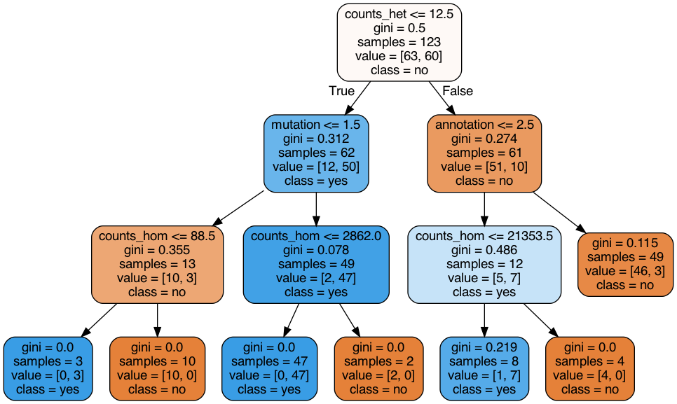

| | "annotation" |         |   "mutation"  |
---------|------------|----------|-----------|
|**1**| codon position 1 | **1** |indel   |
**2**| codon position 2 | **2** | transition |
**3**| codon position 3 | **3** | transversion |
**4**| anticodon loop |  |  |
**5**| non-coding | | |
**6**| replication origin | | |
**7**| rRNA | | |
**8**| tRNA | | |

The decision tree appears to first differentiate high frequency vs. lower frequency heteroplasmic alleles.  Then it considers whether the mutation is an indel (mutation < 1.5) or whether the first and second codon positions are affected (annotation < 2.5).  If a mutation is an indel is it classified as pathogenic if it has fewer than 88.5 homoplasmic instances.  If a mutation is not an indel, then it is classified as pathogenic if it has fewer than 2862 homoplasmic instances.  Mutations that affect the first or second codon positions are labeled as pathogenic, unless they exist with more than 21,353 homoplasmic instances. In general, the more times a variant was detected among individuals, the less likely it was labeled as pathogenic.  

We then tested logistic regression, an SVM with the default radial basis kernel, and a random forest, each over 100 iterations of train/test set splits, model training, and testing to see if a more accurate classifier could be found.  We kept the ccp-α parameter equal to 0.03 for the random forest. The SVM did poorly, with a test accuracy of only 56%, probably due to the absence of a linear decision boundary between classes.  Logistic regression was notably better, with a test accuracy of 75%, but not nearly as well as the random forest, with its test accuracy to 93%, even with regularization.  This classifier had a precision of 0.83 and a recall of 0.86, indicating similar abilities to distinguish true positives and true negatives.  Models are summarized in Table 3.

### Table 3. Informed (biased) classifier accuracies
|  Classifier | Mean Accuracy | Standard Deviation |
|-------------|---------------|--------------------|
|Logistic regression| 0.75 | 0.07 |
| SVM | 0.56 | 0.06 |
| Random forest | 0.93 | 0.05 |

We used this random forest derived from the assumption that higher allele frequencies implied that variants were not pathogenic to predict the pathogenicity of all unclassified bases in the Helix mtDB.  It predicted a total of 1670 pathogenic variants and 11029 non-pathogenic variants.  EDA on these predictions is discussed below.

As mentioned above, we also developed classifiers without making any assumptions as to the likelihood that a more frequent variant may not be pathogenic and instead trained models to distinguish between pathogenic ‘yes’ and pathogenic ‘unknown’ classes.  Given that we were not limited by the number of variants that we classified as not-pathogenic, but were instead only limited by the number of known pathogenic variants, which totaled 846, we sampled 846 bases from the unknown bases to form balanced training and testing data sets.  A decision tree limited to a minimum of 20 samples per leaf gave a test accuracy of 0.71 when distinguishing pathogenic from unknown variants. Cost-complexity pruning with an alpha parameter of 0.003 reduced the tree’s complexity considerably (Figure 12), while still permitting a test accuracy of 0.69.  It is interesting to note that the accuracy of the tree that was uninformed by the assumption that the frequencies of pathogenic alleles would likely be lower than those of known pathogenic variants is roughly 20% lower than that trained with the benefit of human intuition. 

### Figure 12. Decision tree for 'unknown' classes with regularization

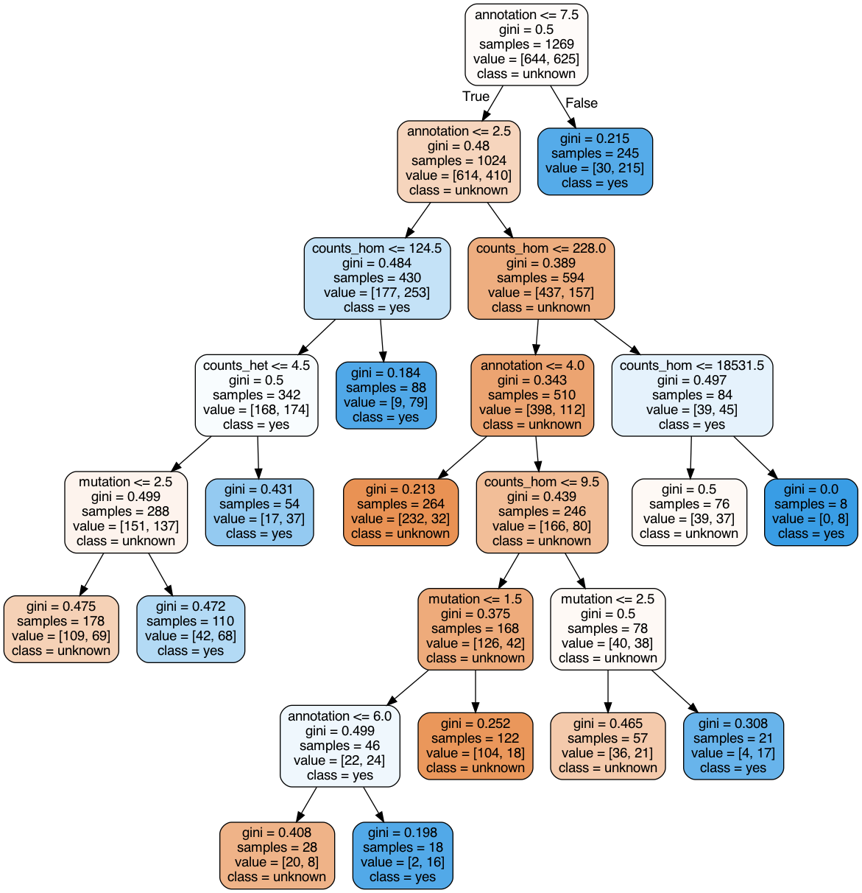

| | "annotation" |         |   "mutation"  |
---------|------------|----------|-----------|
|**1**| codon position 1 | **1** |indel   |
**2**| codon position 2 | **2** | transition |
**3**| codon position 3 | **3** | transversion |
**4**| anticodon loop |  |  |
**5**| non-coding | | |
**6**| replication origin | | |
**7**| rRNA | | |
**8**| tRNA | | |

Feeling that we could obtain a more accurate classifier, we trained logistic regression, SVM, and random forest classifiers as described above over 100 iterations of train/test splits with different random samples of 846 unknown variants.  As before, the random forest yielded the highest test accuracy, 75%, which was about as good as the logistic regression classifier based on our partial manual classification of non-pathogenic bases. The precision of this random forest was 0.67 and its recall was 0.70, indicating that this classifier makes errant false positive and false negative predictions roughly with equal probability. These models are summarized in Table 4.

### Table 4. Summary of unbiased classifier accuracies
|  Classifier | Mean Accuracy | Standard Deviation |
|-------------|---------------|--------------------|
|Logistic regression| 0.61 | 0.02 |
| SVM | 0.54 | 0.03 |
| Random forest | 0.75 | 0.02 |

A closer look at the confusion matrix resulting from an SVM with the default RBF kernel reveled that the SVM was basically calling everything pathogenic, as its precision was only 0.56 but its recall was 1, due to an absence of false negatives.  Changing to a polynomial kernel made absolutely no difference to the performance of this classifier, and changing to a sigmoid kernel also showed no practical improvement.

Given the fairly good test accuracy (93%), of our first random forest classifier we performed EDA on its predictions to see if the variants it called as pathogenic ‘yes’ were similar to the known MitoMap variants observed in patients suspected of having a mitochondrial disorder.  A two-dimensional plot of the logarithm of the number of homoplasmic variants vs. the logarithm of the count of heteroplasmic variants labeled with the predictions of this classifier is shown in Figure 13.  A total of 2163 variants of unknown pathogenicity are predicted as pathogenic and 10536 are labeled as benign. It is clear from the plot that the most frequently occurring variants are labeled as non-pathogenic, which we expected given that model is biased against the possibility that the most frequent variants are pathogenic.  

### Figure 13. Random forest predicted labels (pathogenic yes/no) of 'unknown' variants

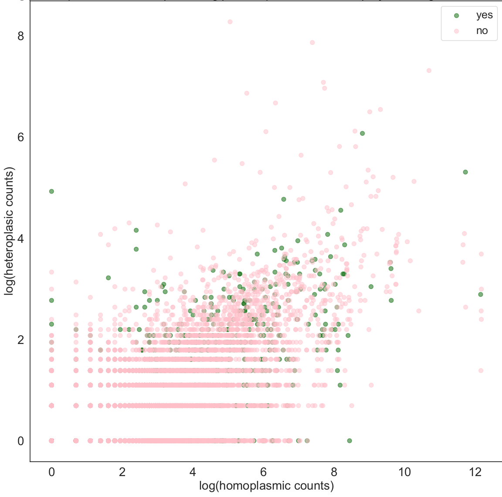

A plot of the number of predicted pathogenic variants by codon position (Figure 14) provides little insight as to whether the random forest’s predictions are accurate.  In fact, there is nothing distinguishing the variants predicted to be pathogenic from the average variant in the HelixMTdb (compare Figure 14 and Figure 3, left).  Most of the variation among the alleles predicted to be pathogenic is still in the third codon position, in contrast to the preponderance of variants at the first and second codon positions of the MitoMap pathogenic alleles. Thus, the model does not appear to be considering codon position when distinguishing a putative pathogenic variant from a benign variant.  

### Figure 14. A random forest fails to distinguish between codon positions for pathogenic variants

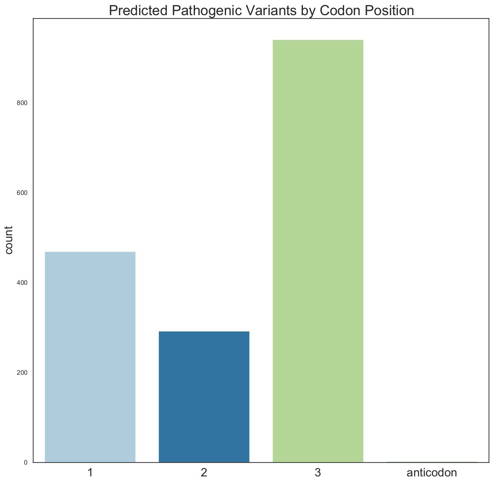

It appears that allele frequency is the primary feature being differentiated. Very few mutations within non-coding sequences are present in both the HelixMTdb and the MitoMap collection of reported pathogenic variants (Figure 15, left).

### Figure 15. Allele frequencies drive decisions made by the random forest classifier

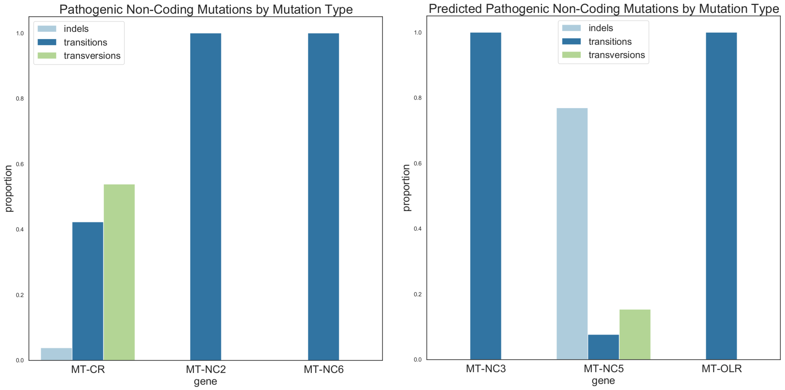

Three homoplasmic (and zero heteroplasmic) mutations affecting the replication origin of the mitochondrial genome are present in the HelixMTdb.  Given the expected role of this region in the maintenance of mtDNA, it is certainly possible that they are deleterious variants that decrease the copy number of mtDNA within cells, although such variants do not appear to be present in the MitoMap collection.  These are the only instances in the HelixMTdb where the annotation of the affected base is “replication origin.”  The random forest predicts that these variants are pathogenic, likely solely on the basis of their rarity (Figure 15, right). Additionally, we suspect that the allele within the non-coding sequence MT-NC5 was classified as pathogenic based on its being an indel, even though most of the variation within MT-NC5 and other non-coding sequences consists of indels (Figure 5, right). Among protein coding sequences, indels are enriched specifically among pathogenic variants (Figure 6).

## Discussion

The HelixMTdb provides a glimpse as to which bases in the human mitochondrial genome are absolutely essential for mitochondrial functions, and are thus invariant.  Most invariant positions correspond to the first and second codon positions in protein coding genes and to the anticodon loops of tRNAs.  In contrast, most variable nucleotides are found in the third position of codons and in non-coding sequences.  These findings make sense in light of the degeneracy of the genetic code largely being due to third base wobble, while the first and second bases of codons principally mediate the specific encoding of amino acids.   Therefore, changes to the first or second positions of codons are much more likely to result in changes to the amino acid sequences of proteins, most of which would be expected to be harmful and thus should be rare in populations. Non coding sequences are more variable than coding sequences because they are not constrained to maintain some function for the cell, other than serving whatever regulatory functions they must in order to set reading frames or serve in the replication or maintenance of mtDNA. Regardless of their actual role, non coding sequences are much more tolerant of sequence variation than expressed sequences.

Mitochondria are strictly maternally inherited and are dispersed throughout the cells of the developing embryo through the vagaries of cell division.  Consequently, the distribution of random mutations varies by cell type and most spontaneous mutations occurring after development are mosaic.  Mutations arising during oogenesis in the mother are also not uniformly present in the population of mitochondria that is passed to the embryo via the oocyte.  This phenomenon is referred to as the mitochondrial genetic bottleneck and it is responsible for the appearance of a mitochondrial disease in the child of a carrier who shows no disease herself, because she simply does not have enough mutant mitochondria in relevant tissues but her child does.  Plasmicity is a measure of the heterogeneity of mitochondrial genomes.  Homoplasmic variants exist uniformly in cells, while heterplasmic variants exist as mixtures with either wild-type or other mutant genomes per cell.  It is possible for a deleterious mutation to exist as a heterplasmic variant because other functional mtDNAs are present in the same cell.  Conversely, it would not be possible for a deleterious mutation to exist within a cell as a homoplasmic variant without causing disease because the only mtDNA available to that cell would be mutant.  Thus, pathogenic variants should not exist as higher frequency homoplasmic variants, but may be detected as lower frequency heteroplastic variants, that do not rise above the threshold abundance required to yield a disease phenotype.  Accordingly, we would expect higher frequency homoplasmic variants to be non-pathogenic.

The HelixMTdb provides a data resource with which to train and test models to classify sequence variants as pathogenic or benign, based on the protein or RNA features they impact and their frequency among the sampled population. Decision trees and random forests performed with highest accuracy versus logistic regression and support vector machines with non-linear kernels, likely because pathogenic and non-pathogenic variants are not linearly separable in our data.  These more successful classifiers appear to operating much like a biologist would when judging the potential pathogenicity of a variant, by asking which sequence features are affected (codon positions, coding vs. non coding sequences) and how frequently the variant was detected.  There is still much room to improve the machine learning approach to pathogenicity prediction for mitochondrial variation.

### The problem with a base by base approach

By not considering the effects of nucleotide changes on amino acid sequences or on secondary structures of functional RNAs, we were ignoring a vast feature space that would likely have helped refine the prediction of the pathogenicity of variants.  We should have proceeded gene by gene, codon by codon to assess whether an amino acid change induced by sequence variation would likely be tolerated by the relevant protein, given the extent of the evolutionary conservation of that amino acid. Given the annotated Cambridge reference human mitochondrial genome sequence, it would not take much effort to determine the effects of each of the variants present in the Helix mtDB at the amino acid level and then to retrain classifiers to examine these data.  Until the catalog of known pathogenic mtDNA variants increases, we will not be able to properly gauge the success of our tree-based models. Although, it may be possible to examine libraries of yeast mitochondrial mutations for mutations affecting bases that correspond to our predicted pathogenic human variants as a way of measuring the accuracy of our predictions.  That would of course be beyond the scope of this course.

## References

Selective constraints and pathogenicity of mitochondrial DNA variants inferred from a novel database of 196,554 unrelated individuals, Bolze and Mendez et al., *BioRxiv*, October 8, 2019.

The similarities between human mitochondria and bacteria in the context of structure, genome, and base excision repair system. Boguszewska, K., Szewczuk, M., Kazmierczak-Baranska, J., and Karwoski, B. *Molecules* 2020, **25**, 2857; doi:10.3390/molecules25122857

Nussbaum, R.L., McInnes, R.R., and Willard, H.F., 2007 *Thompson and Thompson Genetics in Medicine 7th ed.* Philadelphia: Saunders

